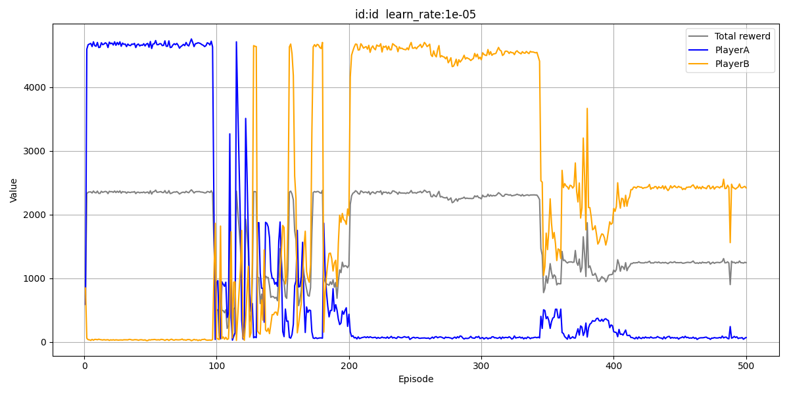
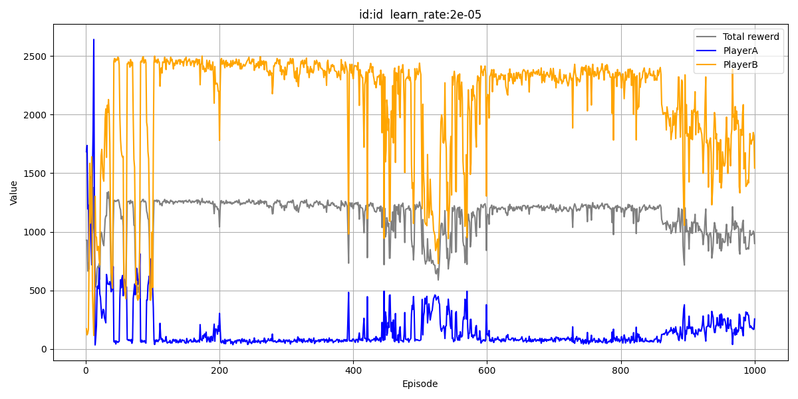
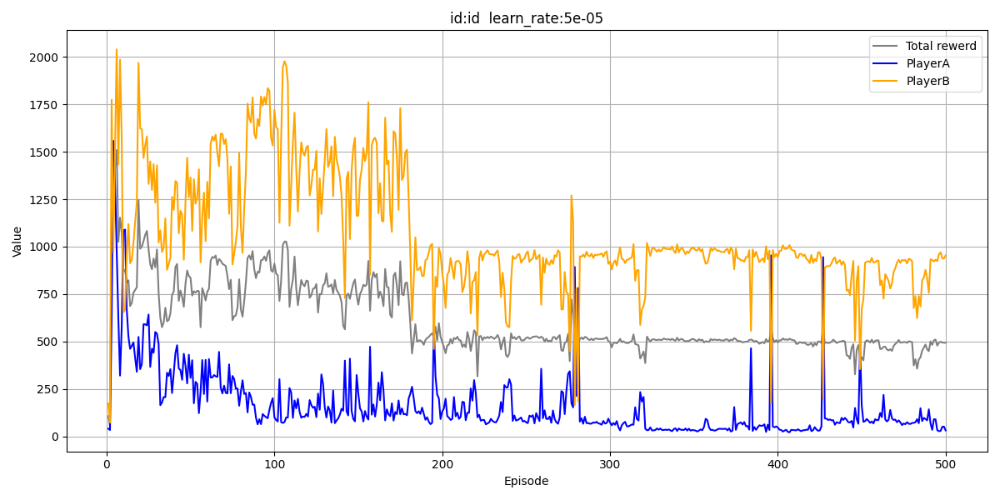
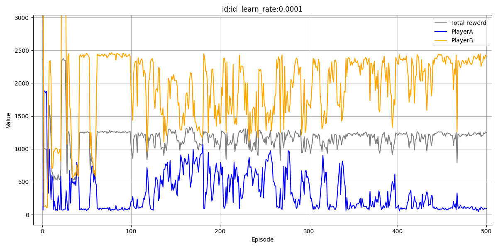
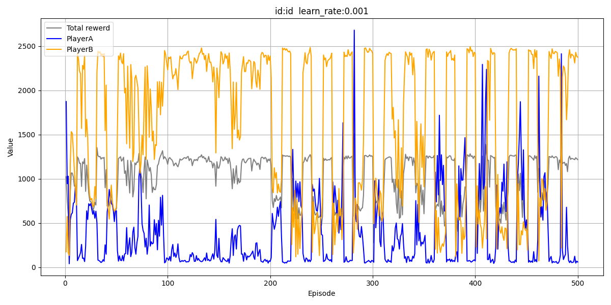

# ファイル説明
- /dqn_rsp125.py
    DQNを構築, 学習を行っている
- /rsp125.py
    環境, 固定戦略の相手を定義

# ルール
- （グー、チョキ、パー）＝（０、１、２）　未定義 ＝　3
- 

## 学習率,割引率,学習回数
| (学習率, 割引率, 回数) | pl_0 | pl_1 | 平均 | メモ | 画像 |
|-|-|-|-|-|-|
|(1e-5, 0.99, 500)| 75 | 2400 |  | b得戦法 | 
|(2e-5, 0.99, 1000)|  |  |  | aはGP50:50, bはCP25:75 | 
|(5e-5, 0.99, 500)| 1000(2百回以降) | 50(時々300) |  | aはCP50:50,bはC100を出す | 
|(1e-4, 0.99, 500)| 200 | 2300 | 1300 | 多少上下はあるが50回目以降この値で安定(1回のみ、以降は上下あり) aがGP50:50,bがP100|
|(5e-4, 0.99, 500)| 700~100 | 2400~400 | 1200~800 | 約10回ごとで激しく上下 aがGP50:50,bがP100 | 
|(1e-3, 0.99, 500)| 2200~80 | 2400~200 | 1200~700 |  | 
|(, 0.99, 500)|  |  |  |  | 
|(, 0.99, 500)|  |  |  |  | 
|(, 0.99, 500)|  |  |  |  | 

- b得戦法
    - aの出す手GCP(0,50,50)  bの出す手(0,0,100)
<!-- 
 -->
