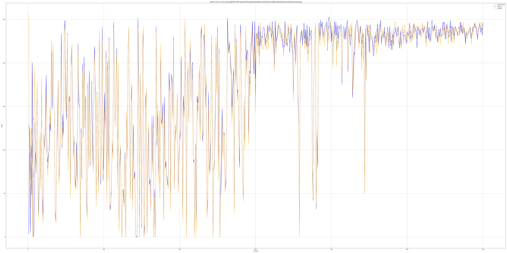
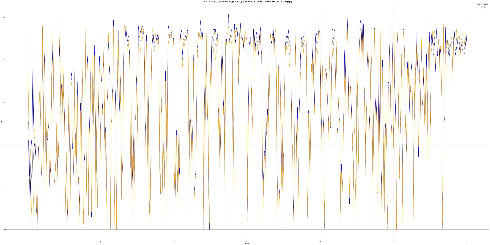
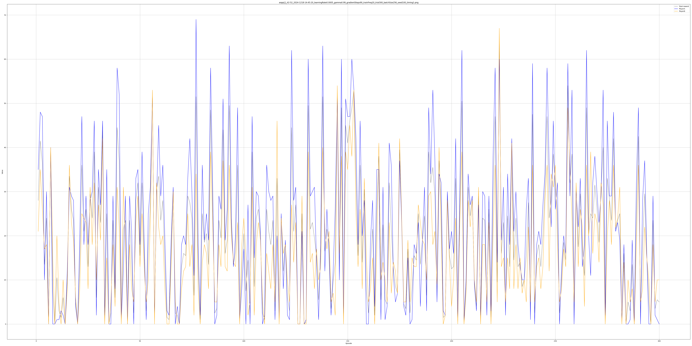

# ファイル説明
- ./learn_dqn.py
    DQNを構築, 学習を行っている
- /rsp125.py
    環境, 固定戦略の相手を定義

# 抄録に使用しているデータ
- しっぺ返し固定戦略
    - ./results/aしっぺ返し_2025-0102-17:29:15_learningRate5e-05_gamma0.99_gradientSteps1000_trainFreq10episode_trial5000_batchSize256_seed42/rew_plot
    - 固定戦略_0102-172915_learningRate5e-05_gamma0.99_gradientSteps1000_trainFreq10episode_trial5000_batchSize256_seed42_step2
- 1.0倍 学習率
    - ./results/サイズ調整(2コおきver)_originDQN_mod0*1.0_2025-0103-12:01:12_learningRate5e-05_gamma0.99_gradientSteps1000_trainFreq10episode_trial10000_batchSize256_nn[64, 64]_seed42/rew_plot
    - 1.0_0103-120112_learningRate5e-05_gamma0.99_gradientSteps1000_trainFreq10episode_trial10000_batchSize256_nn[64, 64]_seed42_step2_timing1
- 1.4倍 学習率
    - ./results/サイズ調整(2コおきver)_originDQN_mod0*1.4_2025-0103-07:30:03_learningRate5e-05_gamma0.99_gradientSteps1000_trainFreq10episode_trial10000_batchSize256_nn[64, 64]_seed42/rew_plot 
    - 1.4_0103-073003_learningRate5e-05_gamma0.99_gradientSteps1000_trainFreq10episode_trial10000_batchSize256_nn[64, 64]_seed42_step2_timing1

<!-- ## run time
|title|run time(m)|img_timing1|img_timing2|
|-|-|-|-|
| a2024-1217-22:35:10_learningRate0.0005_gamma0.99_ gradientSteps100_train_freq100_trial600_batchSize256_seed100 | 36.19 |  |
| a2024-1217-22:40:43_learningRate0.0005_gamma0.99_ gradientSteps10_train_freq10_trial600_batchSize256_seed100 | 37.65 |  |
| a2024-1218-03:09:24_learningRate0.0005_gamma0.99_ gradientSteps10_trainFreq100_trial600_batchSize256_seed100 | 10.60 |  |
| a2024-1218-01:56:51_learningRate0.0005_gamma0.99_ gradientSteps100_train_freq10_trial600_batchSize256_seed100 | 233.50 |  |
| a2024-1218-01:52:54_learningRate0.0005_gamma0.99_ gradientSteps100_train_freq10_trial600_batchSize256_seed100 | 234.08 |  |
| a2024-1218-04:54:20_learningRate0.0005_gamma0.99_ gradientSteps100_trainFreq50_trial600_batchSize256_seed100 | 62.07 |  |
| a2024-1218-05:49:08_learningRate0.0005_gamma0.99_ gradientSteps50_trainFreq10_trial600_batchSize256_seed100 | 116.26 |  |
| a2024-1218-04:36:59_learningRate0.0005_gamma0.99_ gradientSteps80_trainFreq80_trial600_batchSize256_seed100 | 40.06 |  |
| a2024-1218-04:30:40_learningRate0.0005_gamma0.99_ gradientSteps50_trainFreq50_trial600_batchSize256_seed100 | 39.48 |  |
| a2024-1218-11:01:26_learningRate0.0005_gamma0.99_ gradientSteps100_trainFreq30_trial600_batchSize256_seed100 | 121.40 |  |
| a2024-1218-11:17:34_learningRate0.0005_gamma0.99_ gradientSteps40_trainFreq10_trial600_batchSize256_seed100 | 138.54 |  |
| a2024-1218-11:36:37_learningRate0.0005_gamma0.99_ gradientSteps90_trainFreq20_trial600_batchSize256_seed100 | 151.32 |  |
| a2024-1218-12:14:21_learningRate0.0005_gamma0.99_ gradientSteps60_trainFreq10_trial600_batchSize256_seed100 | 195.49 |  |
| a2024-1218-12:40:29_learningRate0.0005_gamma0.99_ gradientSteps10_trainFreq10_trial1000_batchSize256_seed100 | 68.49 |  |  |
| a2024-1218-13:09:22_learningRate0.0005_gamma0.99_ gradientSteps80_trainFreq10_trial600_batchSize256_seed100 | 250.65 |  |
| a2024-1218-13:35:42_learningRate0.0005_gamma0.99_gradientSteps90_trainFreq30_trial600_batchSize256_seed100 | 102.92 |  |
| a2024-1218-14:00:03_learningRate0.0005_gamma0.99_gradientSteps80_trainFreq20_trial600_batchSize256_seed100 | 128.00 |  |
|  |  |  |
|  |  |  |
|  |  |  |

## opp検証
25から41の間

|title|run time(m)|img_timing1|img_timing2|
|-|-|-|-|
| 42-52 |  |  |  |
|  |  |  |  |
|  |  |  |  |
|  |  |  |  | -->

<!-- ## 学習率,割引率,学習回数
| (学習率, 割引率, 回数) | pl_0 | pl_1 | 平均 | メモ | 画像 |
|-|-|-|-|-|-|
||||||| -->

<!-- - b得戦法
    - aの出す手GCP(0,50,50)  bの出す手(0,0,100) -->
<!-- 
 -->
