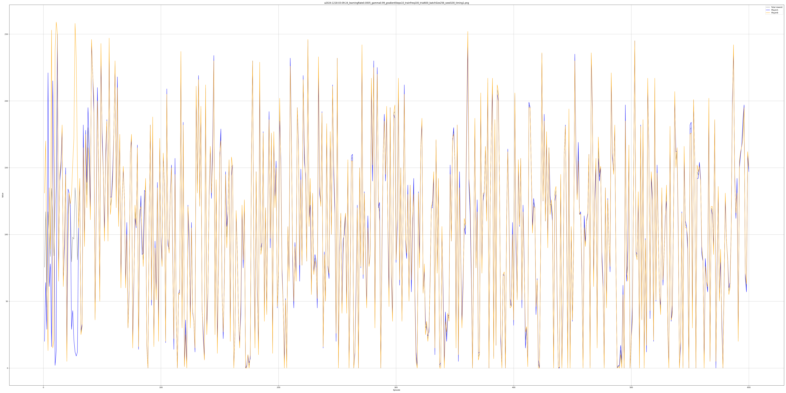

# ファイル説明
- ./learn_dqn.py
    DQNを構築, 学習を行っている
- /rsp125.py
    環境, 固定戦略の相手を定義

# ルール
- （グー、チョキ、パー）＝（０、１、２）　未定義 ＝　3
- 

## run time
|title|run time(m)|img_timing1|img_timing2|
|-|-|-|-|
| a2024-1217-22:35:10_learningRate0.0005_gamma0.99_ gradientSteps100_train_freq100_trial600_batchSize256_seed100 | 36.19 |  |
| a2024-1217-22:40:43_learningRate0.0005_gamma0.99_ gradientSteps10_train_freq10_trial600_batchSize256_seed100 | 37.65 |  |
| a2024-1218-03:09:24_learningRate0.0005_gamma0.99_ gradientSteps10_trainFreq100_trial600_batchSize256_seed100 | 10.60 |  |
| a2024-1218-01:56:51_learningRate0.0005_gamma0.99_ gradientSteps100_train_freq10_trial600_batchSize256_seed100 | 233.50 |  |
| a2024-1218-01:52:54_learningRate0.0005_gamma0.99_ gradientSteps100_train_freq10_trial600_batchSize256_seed100 | 234.08 |  |
| a2024-1218-04:54:20_learningRate0.0005_gamma0.99_ gradientSteps100_trainFreq50_trial600_batchSize256_seed100 | 62.07 |  |
| a2024-1218-05:49:08_learningRate0.0005_gamma0.99_ gradientSteps50_trainFreq10_trial600_batchSize256_seed100 | 116.26 |  |
| a2024-1218-04:36:59_learningRate0.0005_gamma0.99_ gradientSteps80_trainFreq80_trial600_batchSize256_seed100 | 40.06 |  |
| a2024-1218-04:30:40_learningRate0.0005_gamma0.99_ gradientSteps50_trainFreq50_trial600_batchSize256_seed100 | 39.48 |  |
| a2024-1218-11:01:26_learningRate0.0005_gamma0.99_ gradientSteps100_trainFreq30_trial600_batchSize256_seed100 | 121.40 |  |
| a2024-1218-11:17:34_learningRate0.0005_gamma0.99_ gradientSteps40_trainFreq10_trial600_batchSize256_seed100 | 138.54 |  |
| a2024-1218-11:36:37_learningRate0.0005_gamma0.99_ gradientSteps90_trainFreq20_trial600_batchSize256_seed100 | 151.32 |  |
| a2024-1218-12:14:21_learningRate0.0005_gamma0.99_ gradientSteps60_trainFreq10_trial600_batchSize256_seed100 | 195.49 |  |
| a2024-1218-12:40:29_learningRate0.0005_gamma0.99_ gradientSteps10_trainFreq10_trial1000_batchSize256_seed100 | 68.49 |  | 
| a2024-1218-13:09:22_learningRate0.0005_gamma0.99_ gradientSteps80_trainFreq10_trial600_batchSize256_seed100 | 250.65 |  |
|  |  |  |
|  |  |  |
|  |  |  |
|  |  |  |
|  |  |  |

<!-- ## 学習率,割引率,学習回数
| (学習率, 割引率, 回数) | pl_0 | pl_1 | 平均 | メモ | 画像 |
|-|-|-|-|-|-|
||||||| -->

<!-- - b得戦法
    - aの出す手GCP(0,50,50)  bの出す手(0,0,100) -->
<!-- 
 -->
