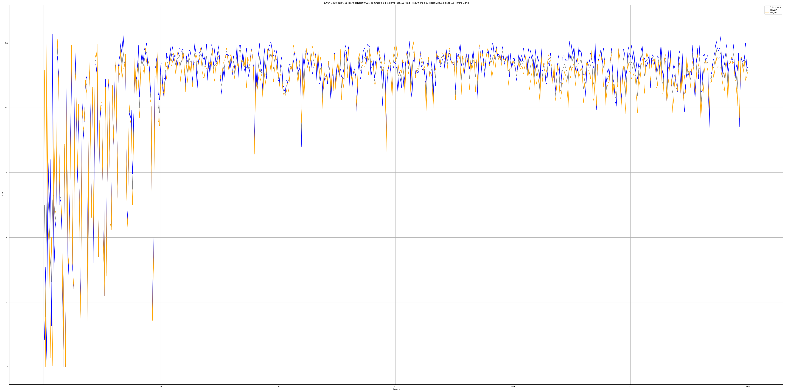
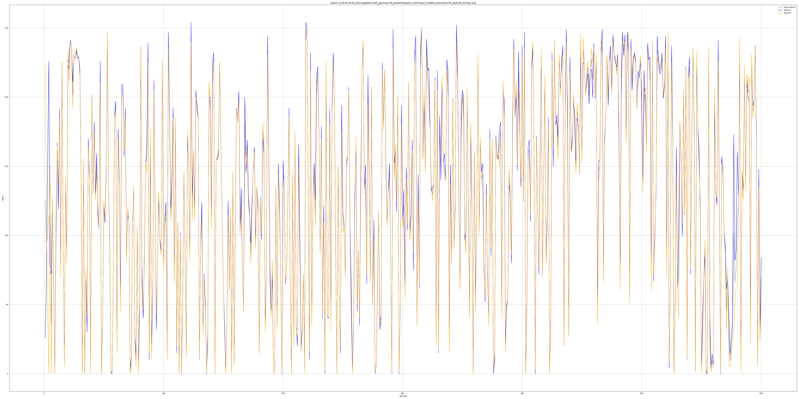
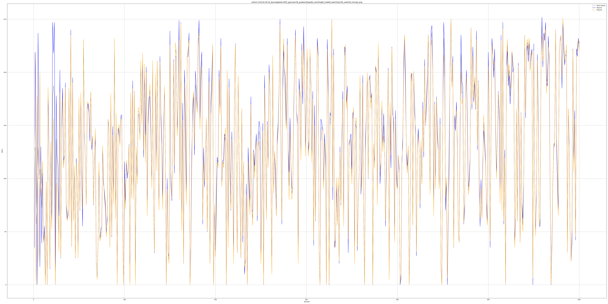
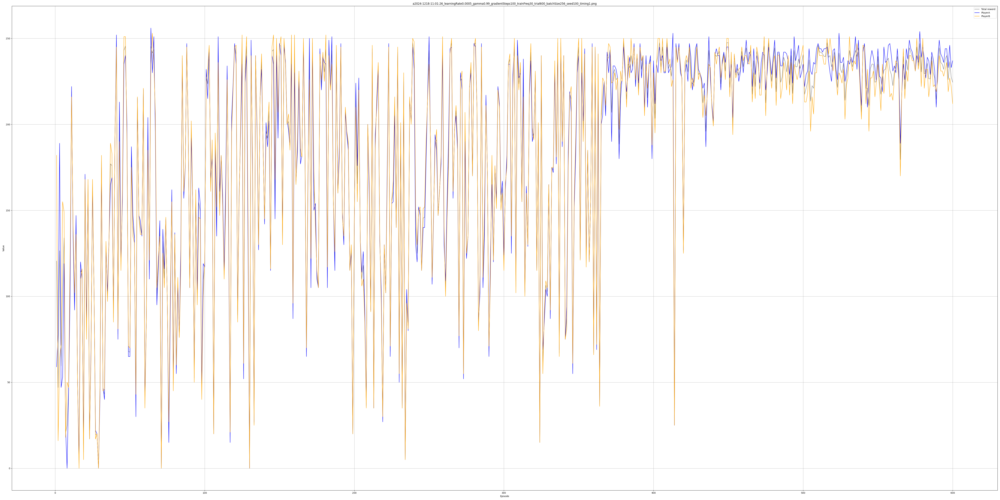
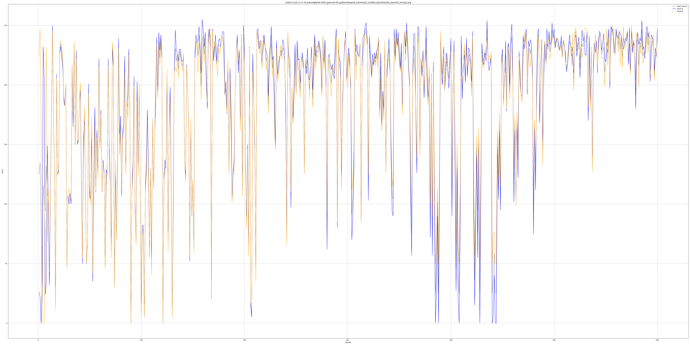

|date|learn_rate|gamma|gradient|freq|trail|bach|seed|run time(m)|img_timing1|img_timing2|
|-|-|-|-|-|-|-|-|-|-|-|
| 2024-1217-22:35:10|0.0005|0.99|100|100|600|256|100| 36.19 |  |
| 2024-1217-22:40:43|0.0005|0.99|10|10|600|256|100| 37.65 |  |
| 2024-1218-03:09:24|0.0005|0.99|10|100|600|256|100| 10.60 |  |
| 2024-1218-01:56:51|0.0005|0.99|100|10|600|256|100| 233.50 |  |
| 2024-1218-01:52:54|0.0005|0.99|100|10|600|256|100| 234.08 |  |
| 2024-1218-04:54:20|0.0005|0.99|100|50|600|256|100| 62.07 |  |
| 2024-1218-05:49:08|0.0005|0.99|50|10|600|256|100| 116.26 |  |
| 2024-1218-04:36:59|0.0005|0.99|80|80|600|256|100| 40.06 |  |
| 2024-1218-04:30:40|0.0005|0.99|50|50|600|256|100| 39.48 |  |
| 2024-1218-11:01:26|0.0005|0.99|100|30|600|256|100| 121.40 |  |
| 2024-1218-11:17:34|0.0005|0.99|40|10|600|256|100| 138.54 |  |
| 2024-1218-11:36:37|0.0005|0.99|90|20|600|256|100| 151.32 |  |
| 2024-1218-12:14:21|0.0005|0.99|60|10|600|256|100| 195.49 |  |
| 2024-1218-12:40:29|0.0005|0.99|10|10|000|256|100| 68.49 |  |  |
| 2024-1218-13:09:22|0.0005|0.99|80|10|600|256|100| 250.65 |  |
|  |  |  |
|  |  |  |
|  |  |  |
|  |  |  |
|  |  |  |